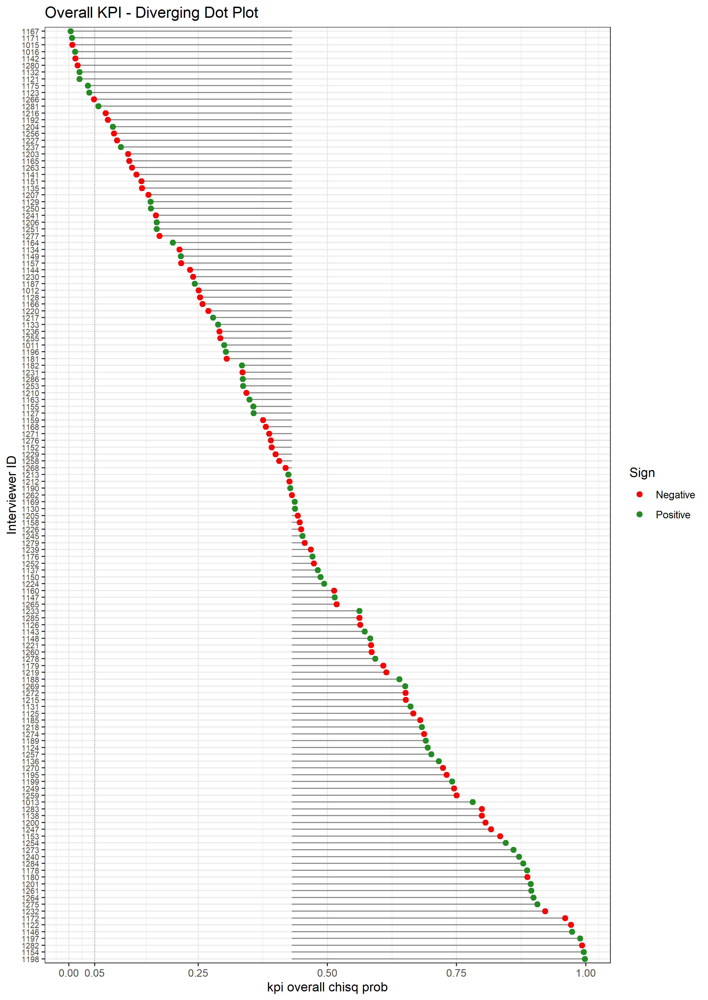

## Introduction 

In the process of in-person survey administration, interviewers were usually sent out to conduct the interview and collect data. However, these data are susceptible to interviewer falsification, thus validation is needed to help detect interviewer falsification. 

Using paradata and interview responses is able to identify detection circumstance at an early stage. 

## Data

Different key performance indicators (KPIs) were created so that each KPI would indicate possible falsification in a certain field. Ranking plots were created for each KPI, as well as the overall KPI, and each interviewer were shown as diverging lollipop where the red dot shows the estimates/values of the KPI for the interviewers and the line shows whether it's possible (above the median) or negative (below the median). 

## Plot

Below are one example of the ranking plots of the overall KPI. The x-axle is the probability of the overall KPI, and the y-axle is the interviewer ID. Red dot indicate the estimate is negative and green means the estimate is positive. The black line indicate whether this interviewer is above the median or below the median. The interviewers were ranked from the smallest to the largest in terms of the probability. The red dotted line indicate the 0.05 probability. Thus, interviewers below the red dotted line and with negative sign are interviewers more likely to be falsified.    

Another more detailed version is created in Shiny, so the users have the ability to choose between different options: ascending/descending, negative/positive, a specific interviewer, and the top 20 interviewers. [Ranking plot in Shiny](https://weijia-ren.shinyapps.io/KPI_vis) 

